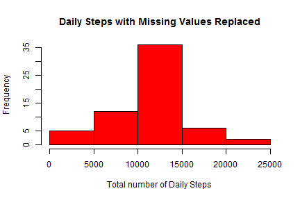

Coursera Reproducible Research Peer Assessment Assignment 1
========================================================
Part 1 - Read in and process the data
-------------------------------------


```r
# read in the data and produce a quick summary
activityData <- read.csv("activity.csv", colClasses = c("numeric", "Date", "numeric"), 
    header = T)
summary(activityData)
```

```
##      steps            date               interval   
##  Min.   :  0.0   Min.   :2012-10-01   Min.   :   0  
##  1st Qu.:  0.0   1st Qu.:2012-10-16   1st Qu.: 589  
##  Median :  0.0   Median :2012-10-31   Median :1178  
##  Mean   : 37.4   Mean   :2012-10-31   Mean   :1178  
##  3rd Qu.: 12.0   3rd Qu.:2012-11-15   3rd Qu.:1766  
##  Max.   :806.0   Max.   :2012-11-30   Max.   :2355  
##  NA's   :2304
```


Part 2 - What is the mean total number of steps taken each day?  
---------------------------------------------------------------
The total number of steps taken per are calculated, and a plot of these totals produced.


```r
# produce an array containing daily sums, and make a histogram
daySum <- tapply(activityData$steps, activityData$date, sum)
hist(daySum, main = "Daily Steps", xlab = "Total number of Daily Steps", col = "blue")
```

 


The mean and median are determined, ignoring missing values.


```r
# calculate the mean
mean(daySum, na.rm = T)
```

```
## [1] 10766
```

```r
# calculate the median
median(daySum, na.rm = T)
```

```
## [1] 10765
```


Part 3 - What is the average daily activity pattern?  
----------------------------------------------------
This can be answered by first looking at a time series plot of the average number of steps taken in each 5-minute time interval, again ignoring missing values.


```r
# construct a data frame of the average steps for each interval
library(plyr)
intMean <- ddply(activityData, .(interval), summarise, mean = mean(steps, na.rm = T))
# plot the steps vs. interval
plot(intMean$interval, intMean$mean, type = "l", main = "Average Steps per Interval", 
    xlab = "Interval (min since 00:00)", ylab = "Average Number of Steps")
```

 


The 5-minute interval in which the maximum number of steps were taken:


```r
# determine the interval with the maximum average number of steps
intMean[(intMean$mean == max(intMean$mean)), ]
```

```
##     interval  mean
## 104      835 206.2
```


Part 4 - Inputing missing values.  
---------------------------------
Several of the intervals,usually by entire days, are missing values for the number of steps.
The total number of missing values for each variable:


```r
# sum the NA's in each column variable
colSums(is.na(activityData))
```

```
##    steps     date interval 
##     2304        0        0
```


A simple method with which to replace the missing values is to use the mean value for that time interval. Once a new data frame is made with the values are replaced,


```r
# create a new data frame with the missing values replaced
aData2 <- activityData
aData2$steps <- replace(activityData$steps, is.na(activityData$steps), round(intMean$mean, 
    1))
```


The previous look at the total daily steps can be reapplied.


```r
hist(tapply(aData2$steps, aData2$date, sum), main = "Daily Steps with Missing Values Replaced", 
    xlab = "Total number of Daily Steps", col = "red")
```

 


And the mean and median values recalculated:


```r
# calculate the mean
mean(tapply(aData2$steps, aData2$date, sum))
```

```
## [1] 10766
```

```r
# calculate the median
median(tapply(aData2$steps, aData2$date, sum))
```

```
## [1] 10766
```


And we can see that there appears to very little bias introduced by the missing values, at least when compared to a new data set with a very simple replacement scheme, and using only the simple measures of mean and median for this comparison.

Part 5 - Are there differences in activity patterns between weekdays and weekends?  
----------------------------------------------------------------------------------
This is examined through creation of a set of two factor variables, weekday and weekend, and assigning the data to each one, based on the type of day. A simple panel plot demonstrates clear differences between the patterns of the average number of steps in each interval, averaged across the weekedays, compared to the weekend.


```r
# create factors based on day of the week, and assign days
aData2$dayType <- ifelse(weekdays(aData2$date) == "Sunday" | weekdays(aData2$date) == 
    "Saturday", "weekend", "weekday")
aData2$dayType <- factor(aData2$dayType)
dayTypeMean <- ddply(aData2, .(interval, dayType), summarise, mean = mean(steps))

# plot steps based on the day factor
library(lattice)
xyplot(dayTypeMean$mean ~ dayTypeMean$interval | dayTypeMean$dayType, type = "l", 
    xlab = "Interval (min since 00:00)", ylab = "Average Number of Steps")
```

 

